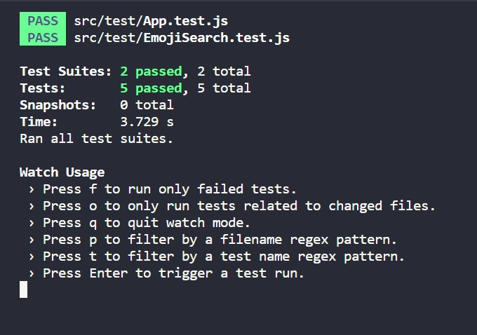

# FMSS_Odev4
FMSS Bilişim Front-end Practicum Ödev-4
Emoji Arama Uygulamasının test kodunun yazılması

Gereksinimler
Başlık kısmının başarılı bir şekilde render edildiğini kontrol edecek olan test kodunu yazın.
Uygulama ilk açıldığında emoji listesinin başarılı bir şekilde render edildiğini kontrol edecek olan test kodunu yazın.
Bir filtreleme işlemi yapıldığında, emoji listesinin bu filtreye uygun şekilde yeniden render edildiğini kontrol edecek olan test kodunu yazın.
Liste üzerinden herhangi emojiye tıklandığında, ilgili emojinin kopyalandığını kontrol edecek olan test kodunu yazın.

Ekran Çıktısı:

